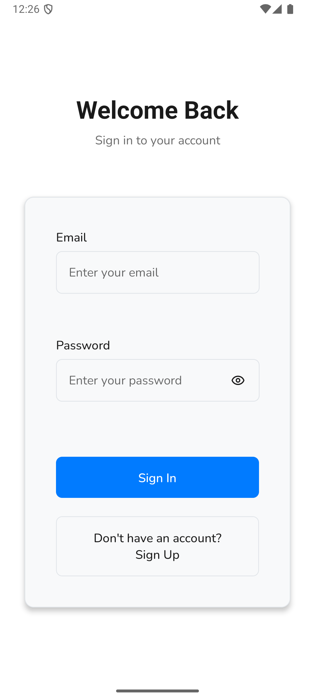
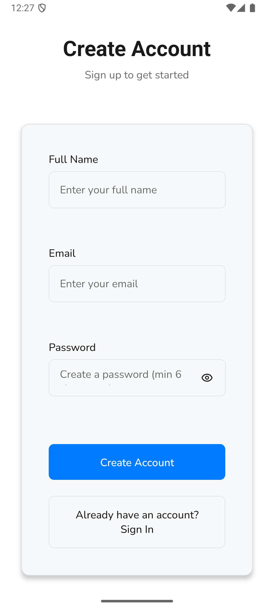
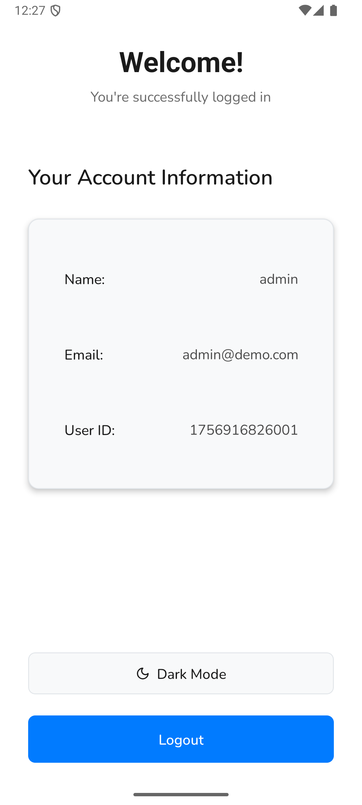
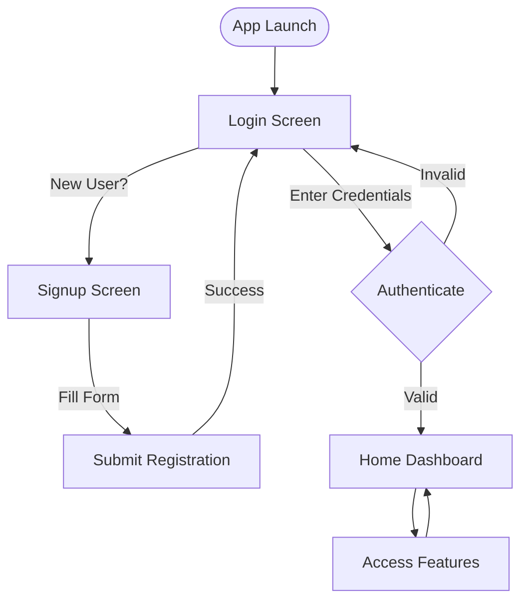

# Amar - App Demo

React Native application built with Expo and Tamagui UI framework.

## Screens

### Login
User authentication entry point.



### Signup
New user registration.



### Home
Main dashboard after authentication.



## User Flow

1. **Start** - User opens app → Login screen
2. **New User** - Tap "Create Account" → Signup screen
3. **Register** - Fill form → Submit → Login screen
4. **Authenticate** - Enter credentials → Login → Home screen
5. **Use App** - Access features from Home dashboard



## Quick Start

```bash
npm install
npm start
```

**Platform Commands:**
- `npm run ios` - iOS Simulator
- `npm run android` - Android Emulator
- `npm run web` - Web Browser

---